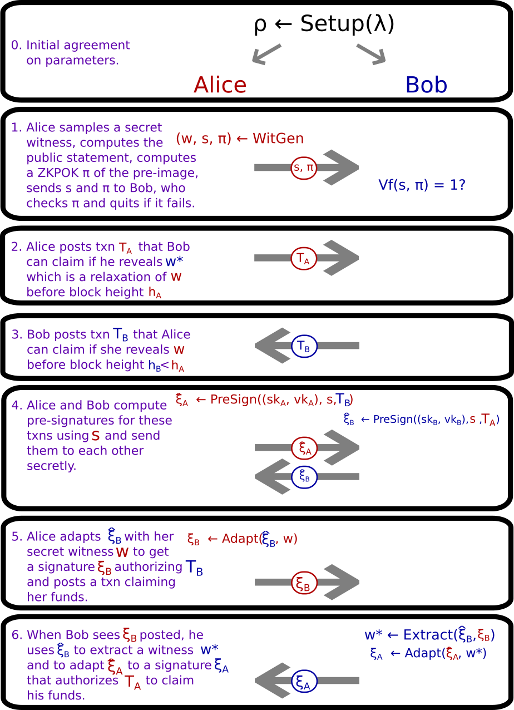

# Zen and the Art of Compact Post-Quantum Finance

Cryptographic schemes that are secure against quantum adversaries are infamous for their relative inefficiency in
comparison to their classically secure counterparts. Nevertheless, the days are numbered for classical cryptography as
quantum computers loom on the horizon. This naturally leads our interest toward cryptographic schemes and protocols that
are designed for quantum resistance. Especially with the advent of cryptocurrencies, the race to develop robust and
commercially viable quantum computers has a tantalizing and profitable prize awaiting the winners, and a highly
disruptive economic future for the rest of us. Hence, it is of critical importance to develop quantum-resistant
cryptography tools and to begin migration to quantum-resistant settings as soon as possible, in the spirit of Quantum
Resistant Ledger. This can mean sacrificing the efficiency of classical cryptography, but (of course!) a robust and
secure cryptographic system is useless if it is too unwieldy to use.

This is a multipart article series exploring avenues toward more efficient quantum-resistant transacting. Back in part
one, we explored a candidate lattice-based one-time signature scheme. The scheme is rather similar in certain ways to
the NIST post-quantum standard candidate, CRYSTALS-Dilithium, and provides an avenue to discuss optimizations available
toward smaller keys and signatures in lattice-based cryptographic schemes. In the second part, we covered the technical
end of _signature aggregation_, at least from one angle. Here in part three, we explore applications built from _adaptor
signatures_, the security models of adaptor signatures, and their implementations. In the final part, we describe a
blockchain-agnostic code-based approach to trustlessly (or, rather, _trust-minimally_) reducing local storage
requirements for network participants while keeping bootstrapping costs low.

## Part Three: Lightening the Load

### Cross-Chain and Off-Chain Transacting

A popular way of looking at blockchains is that they are slow and expensive base layers upon which lighter architecture
can be built. Storage and verification are costs paid collectively, so there is a high priority placed upon minimizing
the total number of interactions with this expensive base layer.

One way users can lighten storage requirements for nodes is to allow users to put collateral up in _payment channels_.
This way, users can transact off-chain, only settling to the base layer occasionally. This is the so-called "lightning
network" model of collateralized swaps. In a slight abuse of prefixes, we can think of these methods as "intra-coin"
collateralized swaps. The usage of this terminology is evocative of an "inter-coin" collateralized swap, which would
allow transacting between two chains.

As it turns out, we can accomplish both of these styles of collateralized swap using so-called _adaptor signatures_,
which have also been known as _verifiably encrypted signatures_.

### How Do Adaptor Signatures Work, and What Are They?

Adaptor signature schemes are cryptographic schemes that have all the functionality of usual digital signature schemes,
but with additional functionality: an adaptor signature scheme produces not just signatures, but also authenticated
commitments called _pre-signatures_. These pre-signatures commit to secret witnesses, can be verified to have been
computed by a signing key, and can be adapted into valid signatures given the secret witness. However, when pre-
signatures are adapted, the commitment is opened, revealing the secret witness. In fact, we require as a subscheme a _
hard relation_.

1. $Setup^*(\lambda) \to \rho$ is a setup algorithm that specifies a witness set $K_W$ and a statement set $K_T$.
2. $RelationGen \to (\underline{w}, s) \in K_W \times K_T$ generates a new witness-statement pair.
3. $RelationVerify(\underline{w}, s) \to b \in \left\{0, 1\right\}^*$ inputs a witness-statement pair and outputs a bit
   indicating whether the witness is valid for the statement.

One way adaptor signatures can be used goes like this, where Alice and Bob perform all the following by secure
side-channel except the final step. First, Bob wants a signature $\xi$ from Alice's key $vk$ on a message $m$ of his
choice posted on a public bulletin board, and Alice wants Bob to give her a secret witness $\underline{w}$ in exchange
for a signature. The secret witness $\underline{w}$ is similar to a private key, and it has a corresponding public
statement $s = \langle \underline{a}, \underline{w} \rangle$, which is akin to a public key. Next, Bob sends Alice $m$,
$s$, and a proof of knowledge of a witness $\underline{w}$ corresponding to $s$, and he asks for a _pre-signature_ from
Alice, say $\hat{\xi}$. This $\hat{\xi}$ is a commitment from Alice to $s$ with properties similar to a signature.
Indeed, $\hat{\xi}$ can be "pre-verified" against the message $m$, the public statement $s$, and Alice's key $vk$.
Moreover, if anyone other than Alice and Bob learn of this $\hat{\xi}$, then it is possible that Alice could be "
scooped;" see below. After that, Alice securely sends Bob $\hat{\xi}$, and he _adapts_ the pre-signature to a signature
$\xi$ using his secret $\underline{w}$. Now, Bob can post $\xi$ to the public bulletin board whenever he chooses.
Lastly, if Bob ever posts $\xi$ to the public bulletin board, Alice can download $\xi$ and use it together with the
secret $\hat{\xi}$ to extract the secret witness $\underline{w}$.

One key point here is that two pieces of secret information is required to compute a signature: both the signing key
$sk$ and the secret witness $\underline{w}$. Furthermore, these two pieces of information are owned by two different
parties who do not necessarily trust each other.

With this use-case in mind, we present our provisional definition of an adaptor signature scheme. An adaptor signature
scheme is a tuple of algorithms $(\texttt{Setup}, \texttt{Keygen}, \texttt{PreSign}, \texttt{PreVerify}, \texttt{Adapt},
\texttt{Sign}, \texttt{Verify}, \texttt{Extract})$ which informally work as follows.

0. The setup algorithm $\texttt{Setup}$ includes a hard relation $(\texttt{Setup}^*, \texttt{RelationGen},
   \texttt{RelationVerify})$ and an unforgeable signature scheme $(\texttt{Setup}^\prime, \texttt{Keygen},
   \texttt{Sign}, \texttt{Verify})$ in its output, as well as a description of a presignature set $\widehat{\Xi}$.
1. $\texttt{PreSign}((sk, vk), s, m) \to \hat{\xi} \in \widehat{\Xi}$. Input a keypair $(sk, vk) \in K_S \times K_V$, a
   public statement $s \in K_T$, and a message $m \in M$, and outputs a pre-signature, $\hat{\xi} \in \widehat{\Xi}$.
2. $\texttt{PreVerify}(vk, s, m, \hat{\xi}) \to b \in \left\{0, 1\right\}$. Input keypair $(sk, vk)$, a public statement
   $s$, a message $m$, and a pre-signature $\hat{\xi}$, and outputs a bit indicating the validity of the pre-signature.
3. $\texttt{Adapt}(\hat{\xi}, \underline{w}) \to \xi \in \Xi$ inputs a pre-signature $\hat{\xi}$ and a secret witness
   $\underline{w}$ and outputs a signature $\xi \in \Xi$.
4. $\texttt{Extract}(\xi, \hat{\xi}) \to \underline{w} \in K_W$. Input a pre-signature $\hat{\xi}$, and a signature
   $\xi$, and outputs a secret witness $\underline{w}$ (or, alternatively, a relaxed witness $\underline{w}^* \in K_W^*
   $; see below).

### Cross-Chain Atomic Swaps

Alice and Bob can compute cross-chain atomic swaps using the following approach.

1. Alice selects a secret witness $\underline{w}$ with corresponding public statement $s$, and sends $s$ to Bob together
   with a proof of knowledge that she knows a secret witness for $s$; if Bob is unconvinced, he proceeds no further.
2. Alice posts a time-locked transaction $T_A$ on the first chain with a long time-lock that is claimable by Bob if he
   reveals $\underline{w}$.
3. After Bob sees Alice's transaction posted on-chain, Bob posts a transaction $T_B$ on the second chain with a shorter
   time-lock that is claimable by Alice if she reveals $\underline{w}$.
4. Alice computes a pre-signature $\hat{\xi}_A$ signing $T_A$ and Bob computes a pre-signature $\hat{\xi}_B$ signing
   $T_B$ and send them to each other via secure side channel.
6. Alice adapts $\hat{\xi}_B$ with $\underline{w}$ to obtain a signature $\xi_B$. Alice can post this on the second
   blockchain to obtain her funds.
7. After seeing $\xi_B$ posted on the second blockchain, Bob can download $\xi_B$ and use $\hat{\xi}_B$ to compute
   $\underline{w} = \texttt{Extract}(\xi_B, \hat{\xi}_B)$. Now, Bob can adapt $\hat{\xi}_A$ with $\underline{w}$ to
   obtain $\xi_A$, which he can post on the first blockchain to claim his funds.

Note that since the time-lock on Bob's transaction is short, Alice has time to claim her funds before the time-lock
elapses. Moreover, after careful thought, it should be clear that either both parties get what they want, or neither
party does. By building refund functionality into the transaction protocol, the users can also guarantee they get their
funds back if something goes wrong. This protocol is summarized in the following diagram.

For example, $\underline{w}$ may be a secret witness that plays a dual role, where it is both a bitwise description of a
small-norm vector in a Module-SIS setting, and also a pre-image for a hash in a pay-to-hash-pre-image cryptocurrency.

### Payment Channel Networks

We can employ the anonymous multi-hop lock (AMHL) approach to developing a payment channel network with lattice-based
approaches.

1. A user selects random secret witnesses $\underline{w}_0, \underline{w}_1, \underline{w}_2, ...$ for each intermediary
   node through which their payment channel will route.
2. The user computes the sequence of partial sums $\sigma_0 = \underline{w}_0, \sigma_1 = \sigma_0 + \underline{w}_1,
   \sigma_2 = \sigma_1 + \underline{w}_2, ...$ and computes their dot product against the key challenge, $P_0 = a *
   \sigma_0, P_1 = a *
   \sigma_1, ...$.
3. The user sends $(P_0, P_1, \underline{w}_1)$ to the first intermediary node, $(P_1, P_2, \underline{w}_2)$ to the
   second intermediary node, $(P_2, P_3, \underline{w}_3)$ to the third intermediary node, and so on.
4. The user sends $P_N$ to the final recipient.
5. Each intermediary verifies that $a * \underline{w}_i + P_{i-1} = a * \sigma_i = P_i$.
6. To make a payment to the final recipient, the user makes a conditional payment to the first intermediary node, who
   then makes a conditional payment to the second intermediary node, and so on. Once all these are placed, the user
   reveals $\underline{w}_N$ to the final recipient. The final recipient adapts a pre-signature to a signature and posts
   it. This allows the last intermediary node to extract a secret witness, from which they can adapt their pre-signature
   to a signature and post on the blockchain. This proceeds backward iteratively until all conditional payments are
   completed.

Just like a positive cloud-to-ground lightning strike actually sees electrons moving from the ground to the sky, the
revelation of secret witnesses proceeds backward from the final recipient to the sending user like a lightning strike.

### The Tricky Part: Security Models

Just as before, without additional properties, the signature scheme is not useful. We take the tactic where we attempt
to provide the reader intuition about how adaptor signatures are used in order to inform their security properties.

In both of the protocols we have described here, users require that pre-signatures can be adapted to valid signatures,
and users require that signature-pre-signature pairs are enough to extract witnesses. And, of course, we require that
signatures are unforgeable. Of course, if signatures are unforgeable and they are easy to adapt from pre-signatures,
then unforgeability of signatures will also imply unforgeability of pre-signatures. This is why protocols with adaptor
signatures can be thought of has having built-in authentication by default. Thus, in addition to unforgeability and
correctness, we have the notions of _pre-signature adaptability_ and _witness extractability_.

#### Correctness

Correctness merely says that the sub-schemes (the hard relation and the signature scheme) are both correct and if honest
parties use the adaptor signature scheme as expected, everything works out. In particular:

1. A pre-signature $\hat{\xi}$ computed from $\texttt{PreSign}$ with an honest keypair $(sk, vk) \leftarrow
   \texttt{Keygen}$ and a statement $s$ on message $m$ passes pre-verification: $\texttt{PreVerify}((sk, vk), s, m,
   \texttt{PreSign}((sk, vk), s, m)) = 1$.
2. Adapting this pre-signature $\hat{\xi}$ with a valid witness $\underline{w}$ for $s$ results in a valid signature
   $\xi$: $\texttt{Verify}(vk, s, m, Adapt(\hat{\xi}, \underline{w})) = 1$.
3. Extracting a witness from this pre-signature and adapted pre-signature results in a valid (although possibly relaxed)
   witness: $\texttt{RelationVerify}(\texttt{Extract}(\hat{\xi}, \xi), s) = 1$.

If the scheme is not correct, then it is possible that $\texttt{PreSign}$ does not produce pre-signatures that pass
verification, even for honest parties. Or, it is possible that $\texttt{Adapt}$ results in an invalid signature. Or, it
is possible that we could extract an invalid witness. If a scheme is correct, then honest users can rest assured that
their pre-signatures will pass pre-verification, can be adapted, and witnesses can be extracted from them.

#### Pre-signature adaptability

This property says that if we have a pre-signature $\hat{\xi}$ on a message $m$ from key $vk$ with statement $s$ that
passes pre-verification and we adapt this pre-signature $\hat{\xi}$ with any valid witness for the statement $s$, then
the adapted pre-signature is a valid signature. This is different from correctness, because we don't necessarily know
whether $\hat{\xi}$ was computed honestly, only that it passes pre-verification.

If a scheme is not pre-signature adaptable, then there may exist a way for an adversary to manufacture a valid-looking
pre-signature that, after adaptation, does not yield a valid signature. Hence, this property ensures that even if a
pre-signature was not computed honestly, honest parties can still rely upon that pre-signature to obtain a signature in
the end just so long as all their inputs pass validity/verification checks.

#### (Weak) Witness Extractability

This property says that if we have a pre-signature $\hat{\xi}$ that passes pre-verification, and a signature $\xi$ that
passes verification, both on the same message $m$ with the same key $vk$ and the same statement $s$, then using the
$\texttt{Extract}$ algorithm will result in a valid (although possibly relaxed) witness for $s$.

This is different from correctness, because we don't necessarily know whether the pre-signature was honestly computed,
or whether the signature was honestly adapted from the pre-signature. All we know is that the pre-signature and
signature pass verification and pre-verification, respectively.

In the schemes we discuss here, we actually do not even attain the property of witness extractability, we only have
_weak witness extractability_, where a _relaxed_ witness can be extracted. In the above model of the lightning network,
using weak witness extractability in a lattice setting, extracted witnesses grow in size until they are too large to be
useful as secret witnesses. This places a natural maximum length on the chain of intermediary payment nodes.

If a scheme is not (weakly) witness extractable, then there may exist a way for an adversary to manufacture a
valid-looking signature that, for all intents and purposes, looks like an adapted pre-signature, and yet from which a (
possibly weak) witness cannot be extracted. Hence, this property ensures that even if a signature (or pre-signature) was
not computed honestly, then honest parties can still extract useful witnesses from them in the end, just so long as all
their inputs pass validity/ verification checks.

#### Unforgeability

We say the scheme is unforgeable if the scheme is correct, pre-signature adaptable, witness or weakly witness extractable, and the underlying signature scheme is unforgeable.

That's it, nothing fancy. We already discussed unforgeability in our first article, so there is no reason to go further down that rabbit hole.

### Conclusion

With adaptor signature schemes, a lot of intra- and inter-chain commerce is enabled based on the claim-or-refund transaction model (see [[1]](https://link.springer.com/chapter/10.1007/978-3-662-44381-1_24)). MITCHELL: HELP HERE PLEASE

### References

[[1]](https://link.springer.com/chapter/10.1007/978-3-662-44381-1_24) Bentov, Iddo, and Ranjit Kumaresan. "How to use bitcoin to design fair protocols." Annual Cryptology Conference. Springer, Berlin, Heidelberg, 2014.

