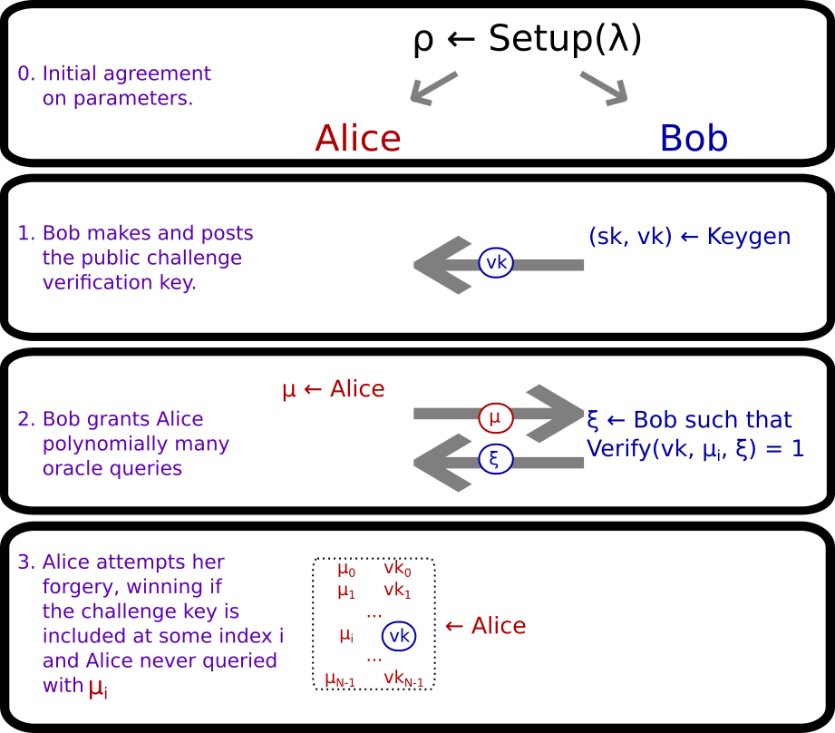

# Zen and the Art of Compact Post-Quantum Finance

Cryptographic schemes that are secure against quantum adversaries are infamous for their relative inefficiency in
comparison to their classically secure counterparts. Nevertheless, the days are numbered for classical cryptography as
quantum computers loom on the horizon. This naturally leads our interest toward cryptographic schemes and protocols that
are designed for quantum resistance. Especially with the advent of cryptocurrencies, the race to develop robust and
commercially viable quantum computers has a tantalizing and profitable prize awaiting the winners, and a highly
disruptive economic future for the rest of us. Hence, it is of critical importance to develop quantum-resistant
cryptography tools and to begin migration to quantum-resistant settings as soon as possible, in the spirit of Quantum
Resistant Ledger. This can mean sacrificing the efficiency of classical cryptography, but (of course!) a robust and
secure cryptographic system is useless if it is too unwieldy to use.

This is a multipart article series exploring avenues toward more efficient quantum-resistant transacting. In the
previous part, we explore a candidate lattice-based one-time signature scheme. The scheme is rather similar in certain
ways to the NIST post-quantum standard candidate, CRYSTALS-Dilithium, and provides an avenue to discuss optimizations
available toward smaller keys and signatures in lattice-based cryptographic schemes. Here in part two, we cover the
technical end of _signature aggregation_, at least from one angle. The third part of this series explores _payment
channels_ constructed with _adaptor signatures_, their security models, and their implementations. In the final part, we
describe a blockchain-agnostic code-based approach to trustlessly (or, rather, _trust-minimally_) reducing local storage
requirements for network participants while keeping bootstrapping costs low.

## Part Two: The Whole Is Greater Than the Sum of Its Parts

### Extending Digital Signatures to Aggregatable Signatures

We begin with aggregatable signatures, whose goal is simple: minimize storage requirements for authentication processes
by compactly describing several signatures in one verifiable aggregated signature.

But, to tell the story of aggregatable signatures requires that we tell the story of usual digital signatures.

A digital signature scheme is a tuple of algorithms $(\texttt{Setup}, \texttt{Keygen}, \texttt{Sign}, \texttt{Verify})$
which informally work as follows.

0. $\texttt{Setup}(\lambda) \to \rho$ inputs a security parameter $\lambda$ and outputs some public parameters, $\rho$,
   which are both taken as input in all other algorithms. As in the previous part of this article series, we drop
   $\lambda$ and $\rho$ from our notation to be concise, taking $\texttt{Setup}$ for granted. Usually, $\rho$ contains a
   description of the signing key set $K_S$, the verification key set $K_V$, the message set $M$, and the signature set
   $\Xi$.
1. $\texttt{Keygen} \to (sk, vk) \in K_S \times K_V$. Output a new random keypair $(sk, vk)$ where $sk$ is a secret
   signing key and $vk$ is a public verification key.
2. $\texttt{Sign}((sk, vk), \mu) \to \xi \in \Xi$. Input keypair $(sk, vk) \in K_S \times K_V$ and message $\mu \in M$,
   and output a signature $\xi \in \Xi$.
3. $\texttt{Verify}(vk, \mu, \xi) \to b \in {0, 1}$. Input a public verification key $vk \in K_V$, a message $\mu \in
   M$, and a signature $\xi \in \Xi$, and output a bit indicating the validity of $\xi$ as a signature on $m$ from $vk$.

As in the last article, we assume that the message set $M$ is the set of all $k$-length bit strings, $M = {0,1}^k$ where
$k$ is an (integral valued) function of $\lambda$. Keeping all the above in mind, the hope behind aggregatable
signatures is to take a typical signature scheme as a sub-scheme and add support for an $\texttt{Aggregate}$ function
and an $\texttt{AggregateVerify}$ function that work roughly as follows.

4. $\texttt{Setup}^\prime$ augments the output of $\texttt{Setup}$ with an _aggregation capacity_ $C$ and an _aggregate
   signature set_ $\Xi_{ag}$.
5. $\texttt{Aggregate}((m_i, vk_i, \xi_i)_{i=0}^{N-1}) \to \texttt{out} \in \Xi_{ag} \cup \left\{\bot\right|}$. Input a
   list of message-key-signature triples $(m_0, vk_0, \xi_0), ..., (m_{N-1}, vk_{N-1}, \xi_{N-1}) \in M \times K_V
   \times \Xi$ and output an aggregate signature $\xi_{ag} \in \Xi_{ag}$ or a distinguished failure symbol, $\bot$.
6. $\texttt{AggregateVerify}((m_i, vk_i)_i, \xi_{ag}) \to b \in {0,1}$. Input a list of messages-key pairs $(m_0, vk_0)
   , ..., (m_{N-1}, vk_{N-1}) \in M \times K_V$ and an aggregate signature $\xi_{ag} \in \Xi_{ag}$ and output a bit $b$
   indicating whether $\xi_{ag}$ is a valid aggregate signature on these message-key pairs.

If signature aggregation requires the participation (and secret signing keys) of all the signers in one or more round of
interaction, the scheme is called *interactive*, otherwise it is called *non-interactive*.

Just like in the previous article, this definition is quite useless without additional properties. To see why, we can
follow the same line of reasoning as our last article. Indeed, if $\Xi_{ag} = \left\{0, 1\right\}$, the scheme is too
simple to be of use. Or, if $\texttt{AggregateVerify}$ always returns a fixed bit, clearly the scheme is useless. And,
just as in the previous article, this leads us to the security properties of aggregate signature schemes.

Before describing security properties, we take a brief aside to discuss the redundancy built into this definition. We
denote an aggregate signature scheme with the tuple of algorithms $(\texttt{Setup}^\prime, \texttt{Keygen},
\texttt{Sign}, \texttt{Verify}, \texttt{Aggregate}, \texttt{AggregateVerify})$, but oftentimes we disregard
$\texttt{Verify}$. After all, a signature $\xi \in \Xi$ on some $\mu \in M$ under $vk \in K_V$ and can be aggregated
alone by computing $\xi_{ag} = Aggregate((m, vk, \xi))$, so that $\texttt{Verify}$ is subsumed by
$\texttt{AggregateVerify}$. However, in practice, there may be situations where aggregating a signature alone is
wasteful of computational time or space, and thus verification of individual signatures may have use cases, which is why
we include it in our definition. However, we avoid basing our security properties below on the $\texttt{Verify}$
algorithm to avoid redundancy and unnecessary security proofs.

#### Correctness

Correctness means that honestly computed signatures have to pass aggregate verification. That is to say, if $1 \leq N
\leq C$ and, for each $i = 0, 1, \ldots, N-1$, each $(sk_i, vk_i) \leftarrow \texttt{Keygen}$, each $\mu_i \in M$, and
each $\xi_i \leftarrow \texttt{Sign}((sk_i, vk_i), \mu_i)$, and $\xi_{ag} \leftarrow \texttt{Aggregate}((\mu_i, vk_i,
\xi_i)_{i=0}^{N-1})$, then $\texttt{AggregateVerify}((\mu_i, vk_i)_{i=0}^{N-1}, \xi_{ag}) = 1$.

#### Aggregate Existential Unforgeability

The definition of existential unforgeability introduced in the previous article does not carry over to aggregate
signatures exactly, although with a few modifications, we obtain the following unforgeability game.

1. First, Alice and Bob agree upon input and output of $\texttt{Setup}^\prime$, to recreate the common situation that
   Alice and Bob have agreed upon some publicly audited and cryptanalyzed signature scheme (cf. the NIST post-quantum
   signature vetting process).
2. Next, Bob runs $\texttt{Keygen}$ to get some _challenge keys_ $(sk, vk)$. Bob sends $vk$ to Alice.
3. Bob grants Alice access to a signature oracle; upon querying this oracle with any $\mu \in M$, Alice receives in
   return an (unaggregated) $\xi \in \Xi$ such that $\texttt{Verify}(vk, \mu, \xi) = 1$. Alice can make queries
   adaptively in any order she likes, and decide on these queries after seeing other oracle query responses.
4. Lastly, Alice outputs either a distinguished failure symbol $\bot$ or a purported forgery 
   $\texttt{forgery} = ((\mu_i, vk_i)_{i=0}^{N-1}, \xi_{ag}) \in (M \times K_V)^N \times \Xi_{ag}$ for some 
   $1 \leq N \leq C$. Alice's forgery is successful if $\texttt{AggregateVerify}(\texttt{forgery}) = 1$ and there exists 
   an index $i \in {0, 1, \ldots, N-1}$ such that 
    1. $vk_i = vk$, the challenge key, and
    2. the signing oracle was not queried with $\mu_i$.

This game is summarized in the following diagram.

#### Compact Aggregation: To glue or not to glue?

A keen-eyed reader may have noticed that we can non-interactively aggregate signatures by merely concatenating or gluing
them together. In other words, if $\xi_i$ is a purported signature on some message $\mu_i$ under a verification key
$vk_i$ for each $i = 0, 1, \ldots, N-1$, then we could define the following.

4. $\texttt{Aggregate}$ inputs $(m_0, vk_0, \xi_0), ..., (m_{N-1}, vk_{N-1}, \xi_{N-1})$ and outputs the $N$-tuple $\xi_
   {ag} = (\xi_0, ..., \xi_{N-1})$.
5. $\texttt{AggregateVerify}$ inputs a list of messages-key pairs $(m_0, vk_0), ..., (m_{N-1}, vk_{N-1})$ and an
   aggregate signature $\xi_{ag}$. Parse $\xi_{ag} = (\xi_0, ..., \xi_{N-1})$, compute each $b_i = \texttt{Verify}(
   \mu_i, vk_i, \xi_i)$, and return $b_{0} \cdot b_{1} \cdot \ldots \cdot b_{N-1}$.

We note that the size of the aggregate signature is exactly $N$ times the size of an individual signature $\xi_i$. That
is to say: $|\xi_{ag}| = O(N)$. This mode of aggregation _linear_ or _trivial_ aggregation, because we can always
perform it with any signature scheme.

This leads us to the notion of _compact_ aggregatable signatures. These are exactly the aggregate signature schemes such
that the size of an aggregate signature is sublinear in $N$. In other words, these are the aggregatable signature
schemes for which it is (asymptotically) more efficient to publish aggregated signatures than to publish individual
signatures.

### Aggregation is not always worth it, though...

Even if a scheme is a compact aggregatable signature scheme (say with $|\xi_{ag}| = O(lg(N))$), then the actual
constants wrapped up in the big O notation here critically determine whether the scheme is actually practical.

For example, in the CRYSTALS-Dilithium signature scheme, which is one of the leading NIST post-quantum standard
signature candidates, we see keys at the highest security level that are $2592$ bytes, and signatures that are $4595$
bytes. As a reality check, it is clear that if we have equally sized keys, then just so long as an aggregate of two
signatures is smaller than $9190$ bytes, then it is more space efficient to aggregate signatures.

Using the same reasoning, publishing $N$ CRYSTALS signatures and keys takes up $7551 N$ bytes. We can compare naively
stacking CRYSTALS-Dilithium signatures against a logarithmically-sized aggregate signature scheme. In fact, we always
need to store keys, and we have $N$ of these, perhaps of size $a$ bytes. And we know that the aggregate signature is $O(
lg(N))$ bytes, so the cost of $N$ keys and one aggregate signature asymptotically approaches $aN + b \cdot lg(N)$ for a
constant $b$. Moreover, it is only worth using this logarithmically sized aggregate signature scheme if $aN + b lg(N) <
7551 N$, and even then only if we can make $N$ sufficiently large.

Of course, we want to favor the use standard signature schemes if possible to minimize implementation risk, avoid
rolling our own crypto, and to ensure compatibility with other systems. So, there are four places a compact aggregatable
signature scheme may find itself:

1. $a >= 7551$ so aggregation is definitely not worth it compared to trivial aggregation; or
2. $a < 7551$ but $b > (7551-a)N/log(N)$ so aggregation is definitely not worth it compared to trivial aggregation; or
3. $a < 7551$ and $b < (7551-a)N/log(N)$ so aggregation is more space-efficient than aggregating signatures compared to
   trivial aggregation, but $aN + b lg(N) < 7551 N$ only by a small margin so space savings are too small to outweigh
   the value of standard signature schemes; or
4. $a < 7551$ and $b < (7551-a)N/log(N)$ and $aN + b lg(N) < 7551 N$ by a large margin, so aggregation may be
   worthwhile, depending on whether the use-case is sensitive to time complexity.

### Case Study: Boneh-Kim-Lyubashevsky-Micciancio Signatures

In [[1]](https://eprint.iacr.org/2013/746.pdf), Lyubashevsky and Micciancio introduced asymptotically efficient
lattice-based digital signatures. In [[4]](https://crypto.stanford.edu/~skim13/agg_ots.pdf), Boneh and Kim formalized a
one-time, non-interactively aggregatable signature scheme based on these signatures. While comparing one-time signatures
to many-time signature schemes is a bit of an apples-to-oranges comparison, we hope the reader is patient with us while
we compare fruit.

Setting some details aside, we can loosely think of the Lyubashevesky-Micciancio signatures roughly as follows: a
signing key is a pair of small-norm vectors $sk = (\underline{x}, \underline{y})$ in a public lattice which has a
challenge vector $a$ part of its public parameters. The verification key is $vk = (X, Y) = (\langle \underline{a},
\underline{x} \rangle, \langle \underline{a}, \underline{y} \rangle)$. To sign a message $\mu$, a user hashes it to get
a small-norm challenge $c$ and computes $\xi = \underline{x}\cdot c +\underline{y}$. Since dot products are linear,
anyone can check that $\langle \underline{a}, \xi \rangle = v \cdot c + u$, and since $\underline{x}$, $\underline{y}$,
and $c$ all have small norms, anyone can check that the signature also has a small norm. On the other hand, if an
algorithm that has no information about $sk$ can output any vector $z$ such that $\langle \underline{a}, \underline{z}
\rangle = X \cdot c + Y$, then we can use that algorithm to construct a solution to a cryptographically hard problem.

Again setting some details aside, we can loosely think of the Boneh-Kim aggregatable extension of these signatures as
follows. To aggregate signatures, some small-norm aggregation coefficients are computed, $\underline{t} = (t_{0}, ...,
t_{N-1}) = hash(salt, (m_0, vk_0), ..., (m_{N-1}, vk_{N-1}))$. From these, $\texttt{Aggregate}$ merely outputs the
linear combination of signatures, $\xi_{ag} = t_{0} \cdot \xi_0 + ... + t_{N-1} \cdot \xi_{N-1}$. Since each signature
is small-norm and each aggregation coefficient is small-norm, the aggregate signature $\xi_{ag}$ is small-norm. So we
can check the norm, and we can check that $\langle \underline{a}, \xi_{ag} \rangle\xi_{ag} = t_
{0} \cdot (v_{0} \cdot c_{0} + u_{0}) + ... + t_{N-1} \cdot (v_{N-1} \cdot c_{N-1} + u_{N-1})$ for
$\texttt{AggregateVerify}$.

In [[3]](https://www.theqrl.org/blog/lattice-algebra-library/), we introduce the lattice_algebra package and briefly
describe how it can be used to concisely implement this sort of scheme. The primary variation comes from tracking not
only the infinity norm of secret signing key vectors, but also their Hamming weights.

We note that the security analysis in the paper [[4]](https://crypto.stanford.edu/~skim13/agg_ots.pdf) is rather
pessimistic, and by tracking not only the infinity norm of secret vectors but also their Hamming weight, we may more
tightly relate the norm of a linear combination of vectors or polynomials to the norms of its inputs and coefficients.
We may also more tightly relate the two-norm with the infinity norm. This improved tightness in security inequalities
expresses itself as smaller keys and signatures.

Our cryptanalysis for parameter selection is not yet complete, so we cannot yet directly determine whether it is more
efficient to store an aggregate BKLM one-time signature with its verification one-time keys, or if it is more space
efficient to naively and linearly stack CRYSTALS-Dilithium signatures. However, as we mentioned, comparing one-time and
many-times signature schemes together is inappropriate. Indeed, for a use-case where one-time keys are unacceptable, the
BKLM signature scheme is immediately deemed inappropriate. We suspect that at least the LM signature scheme, without
aggregation, may enjoy parameters competitively small compared to the parameters of CRYSTALS-Dilithium. Later in this
article series, we will revisit this example in greater detail.

### A Drawback to the BKLM Approach in a Lattice Setting

As it turns out, however, we can already identify a drawback to the BKLM approach to aggregating signatures: verifiers
must compute the aggregation coefficients and transform them all with the Number Theoretic Transform in order to verify
a signature. The number theoretic transform takes time $O(d \cdot lg(d))$ to compute, so to compute one of these for
each aggregation coefficient is $O(N \cdot d \cdot lg(d))$ computation time.

In particular, the methods of the BKLM scheme take at least $O(N \cdot d \cdot lg(d))$ additional verification time
compared to linearly aggregated/stacked usual digital signatures, and has greater memory/space requirements than
verifying individual digital signatures in series. Hence, if a signature application is sensitive to space-time
tradeoffs, careful analysis must be performed before deciding whether aggregatable signatures are worthwhile.

### Conclusion

In the pursuit of more efficient lattice-based signing, we naturally find ourselves investigating the idea of
sublinearly aggregating signatures by providing a short description of those signatures. We present this idea from the
perspective of extending a usual digital signature scheme to an aggregatable one. We note that we can always trivially
aggregate signatures by merely stacking them. This provides a firm comparison point to decide definitively when
aggregating signatures is not worthwhile. We do some back-of-the-napkin computations to decide precise algebraic
constraints under which it is more efficient to stack signatures than it is to aggregate signatures. We also identify a
softer barrier for usefulness of an aggregate signature scheme. Indeed, it is generally developmentally more preferable
to stick with standard signature schemes than it is to develop novel schemes, to minimize implementation errors and
ensure compatibility with other systems, and, moreover, the space and time requirements for verifying aggregate
signatures are greater than stacking signatures. Thus, if there is a steep space-time tradeoff in a particular use-case
to be considered, or if sticking with standard signature algorithms is very preferential to experimental ones, it is
often not worth using aggregate signature schemes, even if they seem to be more space-efficient.

In the next part of this series, we explore how to use adaptor signatures to lighten a blockchain's load via payment
channels and cross-chain atomic swaps. In the final part of the series, we look at using secure fountain architectures
to minimize local storage requirements without compromising blockchain security (at least up to a certain security
model).

### References

[[1]](https://eprint.iacr.org/2013/746.pdf)  Lyubashevsky, Vadim, and Daniele Micciancio. "Asymptotically efficient
lattice-based digital signatures." Theory of Cryptography Conference. Springer, Berlin, Heidelberg, 2008.

[[2]](https://github.com/geometry-labs/lattice-algebra) Geometry Labs' lattice-algebra repository on GitHub.

[[3]](https://www.theqrl.org/blog/lattice-algebra-library/) TheQRL announcement of the lattice-algebra package.

[[4]](https://crypto.stanford.edu/~skim13/agg_ots.pdf) Boneh, Dan, and Sam Kim. "One-Time and Interactive Aggregate
Signatures from Lattices." (2020).

[[5]](https://eprint.iacr.org/2020/845.pdf) Esgin, Muhammed F., Oğuzhan Ersoy, and Zekeriya Erkin. "Post-quantum adaptor
signatures and payment channel networks." European Symposium on Research in Computer Security. Springer, Cham, 2020.

[[6]](https://eprint.iacr.org/2020/1345.pdf) Tairi, Erkan, Pedro Moreno-Sanchez, and Matteo Maffei. "Post-quantum
adaptor signature for privacy-preserving off-chain payments." International Conference on Financial Cryptography and
Data Security. Springer, Berlin, Heidelberg, 2021.
